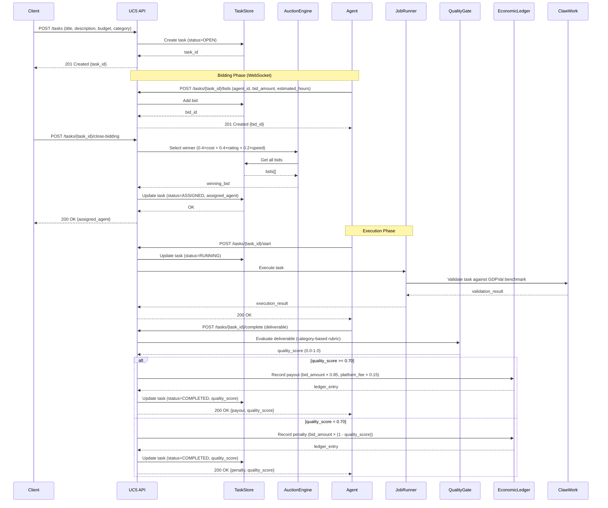
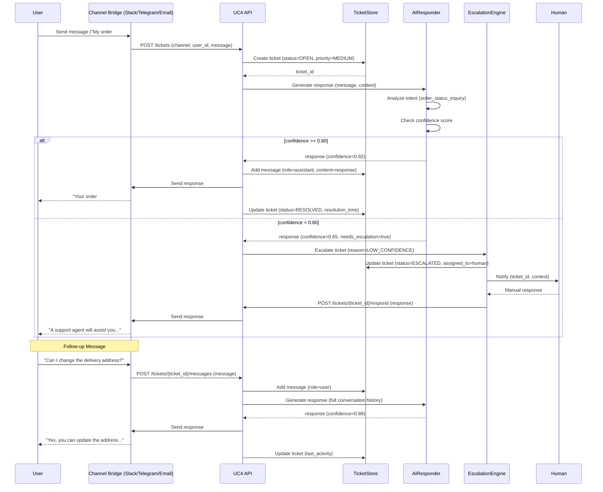
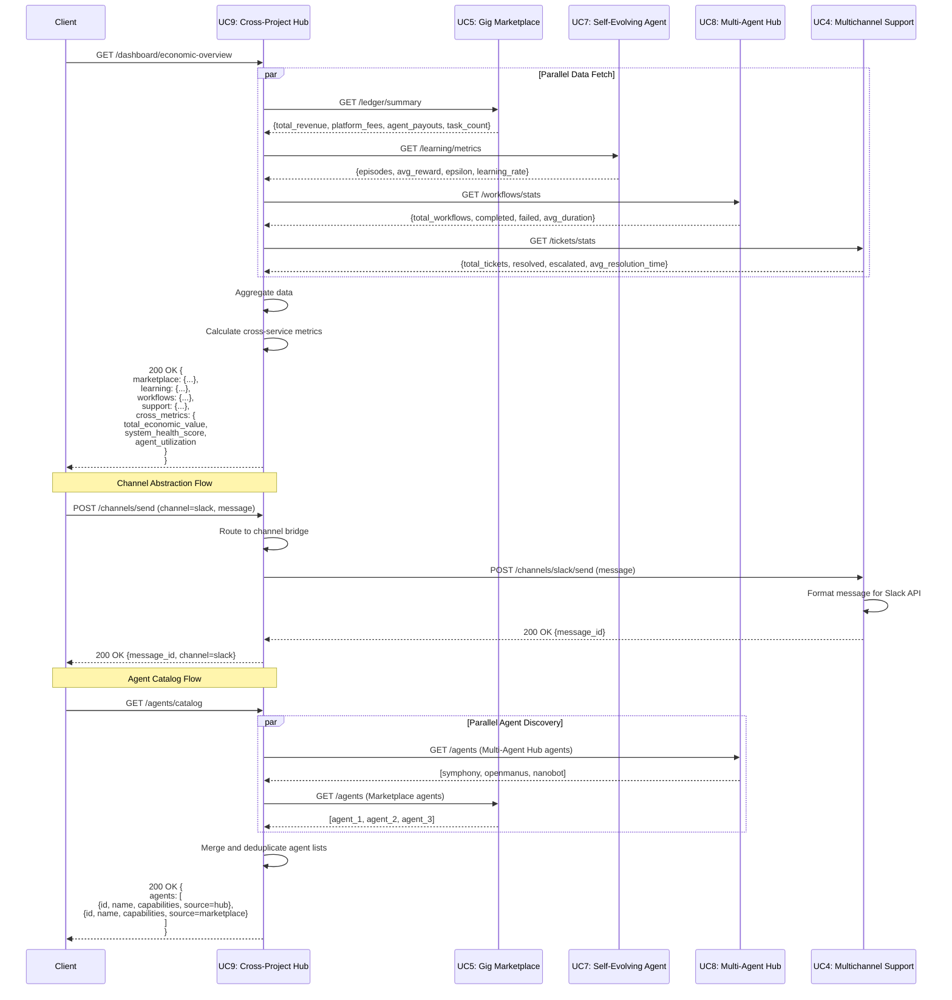

# API & Data Flow Diagrams

**Generated:** 2026-03-10  
**Purpose:** Sequence diagrams for key cross-service workflows

## 1. Gig Task Lifecycle (UC5: AI Gig Marketplace)



## 2. Support Ticket Lifecycle (UC4: Multichannel Support Platform)



## 3. Cross-Service Dashboard (UC9: Cross-Project Hub)



## Key Patterns

### 1. Auction-Based Task Assignment (UC5)
- Multi-factor scoring: 40% cost, 40% agent rating, 20% estimated speed
- Quality gates enforce minimum 0.70 score for full payout
- Platform takes 15% fee on successful completions
- Penalties applied for low-quality deliverables

### 2. AI-First Support with Escalation (UC4)
- Confidence threshold: 0.80 for auto-resolution
- Escalation triggers: low confidence, explicit user request, policy violation
- Full conversation history maintained for context
- Channel-agnostic message routing (Slack, Telegram, Email, Web)

### 3. Cross-Service Orchestration (UC9)
- Parallel API calls for dashboard aggregation
- Channel abstraction layer for unified messaging
- Agent catalog merges multiple registries
- Economic dashboard combines UC5 + UC7 ledgers

## WebSocket Flows

### UC5: Real-Time Bidding
```
Client → WS /ws/tasks/{task_id}/bids
  ← {type: "bid_received", bid_id, agent_id, amount}
  ← {type: "bidding_closed", winning_bid}
  ← {type: "task_completed", quality_score, payout}
```

### UC4: Live Support Chat
```
Client → WS /ws/tickets/{ticket_id}
  → {type: "message", content}
  ← {type: "response", content, confidence}
  ← {type: "escalated", reason, assigned_to}
```

## Notes

- All services use FastAPI with async/await patterns
- Health checks run every 10s with 5s timeout
- UC9 acts as API gateway for cross-service queries
- Economic ledgers use JSONL append-only format
- Quality gates are category-specific (code, design, research, writing)
