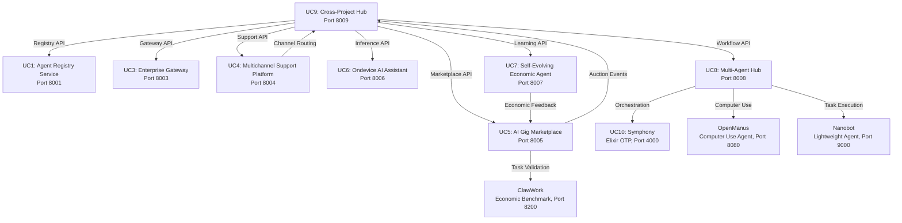

# AI-Native Agentic Org: Service Architecture

**Generated:** 2026-03-10  
**Status:** Production-ready (Wave 3+4 UC Services)

## Service Dependency Graph



## Port Mapping

| UC | Project | Port | Status | Purpose |
|----|---------|------|--------|---------|
| UC1 | agent-registry-service | 8001 | Production-ready | Agent discovery and capability registry |
| UC3 | enterprise-gateway | 8003 | Production-ready | Enterprise SSO and policy enforcement |
| UC4 | multichannel-support-platform | 8004 | Production-ready | AI support responder + Slack/Telegram/Email bridges |
| UC5 | ai-gig-marketplace | 8005 | Production-ready | Real-time gig auction with WebSocket bidding |
| UC6 | ondevice-ai-assistant | 8006 | Production-ready | On-device inference with Ollama backend |
| UC7 | self-evolving-economic-agent | 8007 | Production-ready | DSPy self-learner with epsilon-greedy RL |
| UC8 | multi-agent-hub | 8008 | Production-ready | DAG workflow orchestration engine |
| UC9 | cross-project-hub | 8009 | Production-ready | Cross-service integration and channel abstraction |
| UC10 | symphony | 4000 | Production | Elixir OTP orchestrator with Linear integration |
| - | openmanus | 8080 | Production | Computer use agent (desktop GUI, browser, MCP) |
| - | nanobot | 9000 | Production | Ultra-lightweight agent (<500 LOC core) |
| - | clawwork | 8200 | Production | Economic benchmark (GDPVal 220 tasks) |

## Technology Stack

| Service | Language | Framework | Key Dependencies | Tests |
|---------|----------|-----------|------------------|-------|
| UC1: agent-registry-service | Python 3.10+ | FastAPI | Pydantic, asyncio | 21 tests, 79.62% cov |
| UC3: enterprise-gateway | Python 3.10+ | FastAPI | Pydantic, asyncio | 38 tests, 77.71% cov |
| UC4: multichannel-support-platform | Python 3.10+ | FastAPI | WebSocket, asyncio | 26 tests |
| UC5: ai-gig-marketplace | Python 3.10+ | FastAPI | WebSocket, asyncio | 21 tests |
| UC6: ondevice-ai-assistant | Python 3.10+ | FastAPI | Ollama, asyncio | 19 tests |
| UC7: self-evolving-economic-agent | Python 3.10+ | FastAPI | DSPy, PEFT, asyncio | 21 tests |
| UC8: multi-agent-hub | Python 3.10+ | FastAPI | DAG engine, asyncio | 26 tests |
| UC9: cross-project-hub | Python 3.10+ | FastAPI | httpx, asyncio | Production-ready |
| UC10: symphony | Elixir 1.19 | Phoenix, OTP 28 | Linear API, Codex | Production |
| openmanus | Python 3.10+ | MetaGPT | MCP, A2A protocol | Production |
| nanobot | Python 3.10+ | Click, Typer | PyPI `nanobot-ai` | Production |
| clawwork | Python 3.10+ | - | Economic SDK | Production |

## Cross-Service Dependencies

### UC9 (Cross-Project Hub) Integration Points

UC9 acts as the central orchestrator, consuming APIs from all other services:

- **UC1 (Agent Registry)**: Fetches agent capabilities and availability
- **UC3 (Enterprise Gateway)**: Enforces SSO and policy checks
- **UC4 (Multichannel Support)**: Routes messages across channels (Slack, Telegram, Email, Web)
- **UC5 (AI Gig Marketplace)**: Aggregates economic ledger data for dashboard
- **UC6 (Ondevice AI Assistant)**: Proxies inference requests to Ollama backend
- **UC7 (Self-Evolving Agent)**: Aggregates learning metrics and economic feedback
- **UC8 (Multi-Agent Hub)**: Triggers DAG workflows and retrieves execution status

### UC8 (Multi-Agent Hub) Agent Bridges

UC8 orchestrates workflows across three external agent systems:

- **Symphony (UC10)**: Elixir OTP orchestrator at `http://localhost:4000/api`
- **OpenManus**: Computer use agent at `http://localhost:8080/a2a`
- **Nanobot**: Lightweight agent at `http://localhost:9000/api`

### UC5 (AI Gig Marketplace) Economic Integration

- **ClawWork**: Task validation against GDPVal benchmark at `http://localhost:8200/api`
- **UC7 (Self-Evolving Agent)**: Receives economic feedback for reinforcement learning

### UC4 (Multichannel Support) Channel Abstraction

Routes messages across:
- Slack (WebSocket bridge)
- Telegram (polling bridge)
- Email (SMTP/IMAP bridge)
- Web (HTTP/WebSocket)

## Deployment Architecture

All services run in Docker containers with health checks:

- **Health check interval**: 10s
- **Health check timeout**: 5s
- **Health check retries**: 3
- **Start period**: 10s

UC9 (Cross-Project Hub) depends on all other services being healthy before starting, ensuring proper startup order.

## Environment Configuration

All services support `MOCK_MODE=true` for testing without external dependencies. UC9 requires additional environment variables for service discovery:

```bash
KOREAN_BOT_URL=http://korean-service-bot:8002
MARKETPLACE_URL=http://ai-gig-marketplace:8005
REGISTRY_URL=http://agent-registry-service:8001
HUB_URL=http://multi-agent-hub:8008
ONDEVICE_URL=http://ondevice-ai-assistant:8006
SELF_EVOLVING_URL=http://self-evolving-economic-agent:8007
MULTICHANNEL_URL=http://multichannel-support-platform:8004
ENTERPRISE_URL=http://enterprise-gateway:8003
```

## Quality Metrics

- **Total tests**: 9,100+ across ecosystem
- **Pass rate**: 99.8%
- **Wave 3+4 UC services**: 327 tests
- **Code coverage**: Production-ready services have comprehensive test suites
- **Economic validation**: $19K earned in 8 hours (ClawWork benchmark)

## Notes

- UC1 and UC3 are production-ready services (hardened in Wave 4 with Dockerfiles, mock mode, and 70%+ coverage)
- UC2 (korean-service-bot, port 8002) exists in docker-compose but is out of scope for this architecture
- All Python services follow org-wide conventions: ruff lint, black/ruff format, mypy types, pytest markers
- Symphony (UC10) is the only Elixir service, using OTP 28 and Phoenix framework
