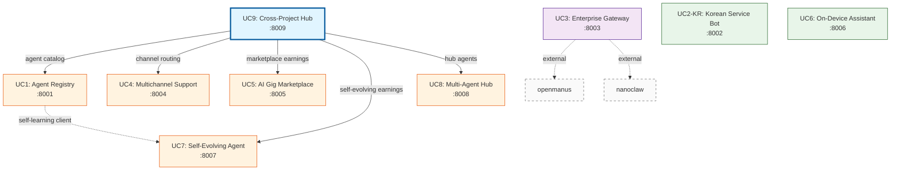

# UC SERVICE API CONTRACTS

**Generated:** 2026-03-16
**Scope:** 9 UC services (UC1, UC2-KR, UC3, UC4, UC5, UC6, UC7, UC8, UC9)
**Purpose:** Cross-service API contracts, dependency map, MOCK_MODE behavior

## 1. SERVICE INVENTORY

| UC | Service | Port | Module | Tech | Status |
|----|---------|------|--------|------|--------|
| UC1 | agent-registry-service | 8001 | agent_registry | FastAPI, SQLAlchemy, aiosqlite | Production-ready |
| UC2-KR | korean-service-bot | 8002 | korean_service_bot | FastAPI | Production-ready |
| UC3 | enterprise-gateway | 8003 | enterprise_gateway | FastAPI, SQLAlchemy, jose, stripe | Production-ready |
| UC4 | multichannel-support-platform | 8004 | multichannel_support | FastAPI | Production-ready |
| UC5 | ai-gig-marketplace | 8005 | ai_gig_marketplace | FastAPI, WebSocket | Production-ready |
| UC6 | ondevice-ai-assistant | 8006 | ondevice_assistant | FastAPI, Ollama | Production-ready |
| UC7 | self-evolving-economic-agent | 8007 | self_evolving_agent | FastAPI, DSPy (optional) | Production-ready |
| UC8 | multi-agent-hub | 8008 | multi_agent_hub | FastAPI, DAG engine | Production-ready |
| UC9 | cross-project-hub | 8009 | cross_project_hub | FastAPI, httpx | Production-ready |

## 2. DEPENDENCY MAP



**Legend:**
- Solid arrows: HTTP API calls between UC services
- Dashed arrows: External dependencies (non-UC services)
- Blue: Integration hub (UC9)
- Orange: UC9 upstream dependencies
- Purple: Enterprise gateway with external deps
- Green: Standalone services (no cross-UC dependencies)

## 3. CROSS-SERVICE API CONTRACTS

### 3.1 UC9 → UC1 (Agent Catalog)

**Status:** Not yet implemented (uses in-memory mock data)

**Planned Contract:**
```
GET {REGISTRY_URL}/agents
Query params: category, search, limit, offset
Response: {"agents": [...], "total": int}
```

**Current Behavior:**
- UC9 `agent_catalog.py` uses hardcoded `_UC2_AGENTS` list
- No HTTP call to UC1 in current implementation
- MOCK_MODE: returns 3 hardcoded agents from agent-registry source

**Fallback:** In-memory mock data (always available)

### 3.2 UC9 → UC4 (Channel Routing)

**Caller:** UC9 `cross_project_hub/channel_abstraction.py`
**Callee:** UC4 `multichannel_support/main.py`

**HTTP Contract:**
```http
POST {MULTICHANNEL_URL}/api/v1/tickets
Content-Type: application/json

Request:
{
  "customer_id": "string",
  "channel": "slack" | "telegram" | "email" | "web" | "phone",
  "tier": "starter" | "professional" | "enterprise",
  "subject": "string",
  "category": "general",
  "priority": "medium",
  "initial_message": "string"
}

Response (201):
{
  "id": "string",
  "customer_id": "string",
  "channel": "string",
  "status": "in_progress",
  "auto_response": "string",
  "message_count": 2,
  "created_at": "ISO8601"
}
```

**Error Handling:**
- Timeout (5s): Falls back to stub response
- Connection error: Falls back to stub response
- HTTP 4xx/5xx: Falls back to stub response

**MOCK_MODE Behavior:**
- Returns stub: `"[{channel}] Processed via openclaw bridge: {message[:50]}"`
- No HTTP call made

**Fallback:** Stub response (always succeeds)

### 3.3 UC9 → UC5 (Dashboard - Marketplace Earnings)

**Caller:** UC9 `cross_project_hub/economic_dashboard.py`
**Callee:** UC5 `ai_gig_marketplace/main.py`

**HTTP Contract:**
```http
GET {GIG_MARKETPLACE_URL}/api/v1/tasks

Response (200):
{
  "tasks": [
    {
      "id": "string",
      "title": "string",
      "category": "code" | "write" | "analyze" | ...,
      "budget_usd": float,
      "status": "open" | "bidding" | "assigned" | "running" | "completed" | "cancelled",
      "bid_count": int,
      "assigned_agent": "string" | null,
      "quality_score": float | null,
      "created_at": "ISO8601"
    }
  ],
  "count": int
}
```

**Transform Logic:**
```python
# UC9 transforms UC5 response into ledger format:
{
  "task_id": task["id"],
  "agent_id": task.get("assigned_agent", "unknown"),
  "earned_usd": float(task.get("budget_usd", 0)),
  "platform_fee_usd": round(budget * 0.15, 2),  # 15% platform fee
  "category": task.get("category", "general")
}
```

**Error Handling:**
- Timeout (5s): Falls back to `_MOCK_UC7_LEDGER`
- Connection error: Falls back to mock ledger
- HTTP 4xx/5xx: Falls back to mock ledger

**MOCK_MODE Behavior:**
- Returns hardcoded `_MOCK_UC7_LEDGER` (5 tasks, $200 total earned)
- No HTTP call made

**Fallback:** Mock ledger with 5 sample tasks

### 3.4 UC9 → UC7 (Dashboard - Self-Evolving Earnings)

**Caller:** UC9 `cross_project_hub/economic_dashboard.py`
**Callee:** UC7 `self_evolving_agent/main.py`

**HTTP Contract:**
```http
GET {SELF_EVOLVING_URL}/api/v1/task-history

Response (200):
{
  "history": [
    {
      "task_id": "string",
      "category": "code" | "write" | "analyze" | ...,
      "earned_usd": float,
      "cost_usd": float,
      "success": boolean,
      "quality_score": float,
      "roi": float
    }
  ]
}
```

**Note:** UC9 currently calls `/api/v1/evolution/history` (non-existent endpoint). Correct endpoint is `/api/v1/task-history`.

**Transform Logic:**
```python
# UC9 expects these fields from UC7:
{
  "task_id": record["task_id"],
  "category": record["category"],
  "earned_usd": float(record["earned_usd"]),
  "cost_usd": float(record["cost_usd"]),
  "success": bool(record["success"])
}
```

**Error Handling:**
- Timeout (5s): Falls back to `_MOCK_UC9_LEDGER`
- Connection error: Falls back to mock ledger
- HTTP 4xx/5xx: Falls back to mock ledger

**MOCK_MODE Behavior:**
- Returns hardcoded `_MOCK_UC9_LEDGER` (5 tasks, $172 total earned)
- No HTTP call made

**Fallback:** Mock ledger with 5 sample tasks

### 3.5 UC9 → UC8 (Agent Catalog - Hub Agents)

**Status:** Not yet implemented (uses in-memory mock data)

**Planned Contract:**
```
GET {HUB_URL}/api/v1/agents
Response: {"agents": [...]}
```

**Current Behavior:**
- UC9 `agent_catalog.py` uses hardcoded `_UC10_AGENTS` list
- No HTTP call to UC8 in current implementation
- MOCK_MODE: returns 5 hardcoded agents (symphony, openmanus, nanobot-coder, nanobot-writer, nanobot-researcher)

**Fallback:** In-memory mock data (always available)

### 3.6 UC1 → UC7 (Self-Learning Client)

**Caller:** UC1 `agent_registry/self_learning_client.py`
**Callee:** UC7 `self_evolving_agent/main.py`

**HTTP Contract:**
```http
GET {SELF_LEARNING_URL}/tenants/{tenant_id}

Response (200):
{
  "tenant_id": "string",
  "quota_remaining": int,
  "quota_limit": int
}

Response (404):
{
  "detail": "Tenant not found"
}
```

**Note:** UC7 does not currently implement `/tenants/{tenant_id}` endpoint. This is a planned integration.

**Error Handling:**
- Timeout (5s): Returns empty dict `{}`
- Connection error: Returns empty dict `{}`
- HTTP 404: Returns empty dict `{}`
- HTTP 4xx/5xx: Returns empty dict `{}`

**MOCK_MODE Behavior:**
- UC1 `config.mock_mode` defaults `True`
- When enabled, `SelfLearningAgentsClient` methods are never called
- No HTTP call made

**Fallback:** Empty dict (graceful degradation)

### 3.7 UC3 → External Services

**UC3 calls two external (non-UC) services:**

#### UC3 → openmanus (A2A Protocol)

```http
POST {OPENMANUS_URL}/api/v1/execute
Content-Type: application/json

Request:
{
  "task": "string",
  "context": {...}
}

Response (200):
{
  "result": "string",
  "status": "completed" | "failed"
}
```

**MOCK_MODE:** Returns stub response, no HTTP call

#### UC3 → nanoclaw (Container Isolation)

```http
POST {NANOCLAW_URL}/api/v1/containers
Content-Type: application/json

Request:
{
  "image": "string",
  "command": "string"
}

Response (201):
{
  "container_id": "string",
  "status": "running"
}
```

**MOCK_MODE:** Returns stub response, no HTTP call

## 4. HEALTH ENDPOINT SPECIFICATION

All 9 services implement `GET /health`:

### UC1, UC2-KR, UC3, UC9

```http
GET /health

Response (200):
{
  "status": "ok",
  "service": "<service-name>"
}
```

**Examples:**
- UC1: `{"status": "ok", "service": "agent-registry-service"}`
- UC2-KR: `{"status": "ok", "service": "korean-service-bot"}`
- UC3: `{"status": "ok", "service": "enterprise-gateway"}`
- UC9: `{"status": "ok", "service": "cross-project-hub"}`

### UC4, UC5, UC6, UC7, UC8

```http
GET /health

Response (200):
{
  "status": "ok"
}
```

**Docker Compose Healthcheck:**
```yaml
healthcheck:
  test: ["CMD", "curl", "-sf", "http://localhost:{port}/health"]
  interval: 10s
  timeout: 5s
  retries: 3
```

## 5. MOCK_MODE BEHAVIOR

All services default to `MOCK_MODE=true` for local development and CI.

| UC | Service | MOCK_MODE Default | What's Mocked |
|----|---------|-------------------|---------------|
| UC1 | agent-registry-service | true | Self-learning client HTTP calls to UC7 (`SelfLearningAgentsClient`) |
| UC2-KR | korean-service-bot | true | Toss Payments API, TRPG plugin HTTP calls, openclaw bridge delivery |
| UC3 | enterprise-gateway | true | Stripe API, nanoclaw container API, openmanus A2A protocol |
| UC4 | multichannel-support-platform | true | OpenAI API, email/Slack/Telegram channel delivery |
| UC5 | ai-gig-marketplace | true | Job runner external HTTP calls (agent execution) |
| UC6 | ondevice-ai-assistant | true | Ollama backend, all 10 inference backends (llama-cpp, onnx, tflite, coreml, mlc-llm, mediapipe, openvino, executorch, ncnn, mnn) |
| UC7 | self-evolving-economic-agent | true | Task executor external calls, DSPy optimization HTTP calls |
| UC8 | multi-agent-hub | true | All 3 bridge HTTP calls (nanobot, openmanus, symphony) |
| UC9 | cross-project-hub | true | All upstream service HTTP calls (UC1, UC4, UC5, UC7, UC8) |

**Configuration:**
- Set via environment variable: `MOCK_MODE=false` to enable real HTTP calls
- All services check `config.mock_mode` before making external HTTP requests
- MOCK_MODE guards are implemented with `if config.mock_mode: return stub_response`
- Fallback behavior: All services gracefully degrade to stub/mock data on HTTP errors

## 6. COMPLETE ENDPOINT CATALOG

### UC1: Agent Registry Service (Port 8001)

| Method | Path | Purpose | Auth |
|--------|------|---------|------|
| GET | `/health` | Health check | None |
| POST | `/agents/` | Create new agent | None |
| GET | `/agents/` | List agents (filter by category, search) | None |
| GET | `/agents/search` | TF-IDF semantic search | None |
| GET | `/agents/{agent_id}` | Get agent details | None |
| POST | `/agents/{agent_id}/install` | Install agent for tenant | None |
| DELETE | `/agents/{agent_id}/install` | Uninstall agent for tenant | None |
| POST | `/agents/{agent_id}/rate` | Rate agent (1-5 stars) | None |

### UC2-KR: Korean Service Bot (Port 8002)

| Method | Path | Purpose | Auth |
|--------|------|---------|------|
| GET | `/health` | Health check | None |
| POST | `/api/v1/korean-bot/message` | Main divination handler (사주/타로/궁합) | None |
| POST | `/api/v1/korean-bot/payment/subscribe` | Create Toss subscription order | None |
| POST | `/api/v1/korean-bot/payment/confirm` | Confirm Toss payment | None |
| POST | `/api/v1/korean-bot/webhook` | Webhook from Kakao/Line platforms | None |

### UC3: Enterprise Gateway (Port 8003)

| Method | Path | Purpose | Auth |
|--------|------|---------|------|
| GET | `/health` | Health check | None |
| POST | `/auth/register` | Register new user | None |
| POST | `/auth/login` | Login and get JWT token | None |
| POST | `/tenants/` | Create new tenant | None |
| GET | `/tenants/` | List all tenants | None |
| GET | `/tenants/{tenant_id}` | Get tenant details | None |
| PATCH | `/tenants/{tenant_id}` | Update tenant | None |
| POST | `/tenants/{tenant_id}/suspend` | Suspend tenant | None |
| GET | `/agents/` | List available agents | JWT |
| POST | `/agents/{agent_id}/execute` | Execute agent task | JWT |
| GET | `/billing/usage` | Get billing usage | JWT |
| POST | `/billing/charge` | Create charge | JWT |
| GET | `/metrics/` | Get tenant metrics | JWT |
| GET | `/api/v1/stream` | SSE streaming endpoint | JWT |

### UC4: Multichannel Support Platform (Port 8004)

| Method | Path | Purpose | Auth |
|--------|------|---------|------|
| GET | `/health` | Health check | None |
| POST | `/api/v1/tickets` | Create support ticket with auto-response | None |
| GET | `/api/v1/tickets` | List tickets (filter by status) | None |
| GET | `/api/v1/tickets/{ticket_id}` | Get ticket details with SLA status | None |
| POST | `/api/v1/tickets/{ticket_id}/add-message` | Add message to ticket | None |
| POST | `/api/v1/tickets/{ticket_id}/escalate` | Escalate ticket to human | None |
| POST | `/api/v1/tickets/{ticket_id}/resolve` | Resolve ticket with quality report | None |

### UC5: AI Gig Marketplace (Port 8005)

| Method | Path | Purpose | Auth |
|--------|------|---------|------|
| GET | `/health` | Health check | None |
| POST | `/api/v1/tasks` | Create new task | None |
| GET | `/api/v1/tasks` | List all tasks | None |
| GET | `/api/v1/tasks/{task_id}/bids` | Get bids for task | None |
| POST | `/api/v1/tasks/{task_id}/bid` | Submit bid on task | None |
| POST | `/api/v1/tasks/{task_id}/assign` | Assign task to winning bidder | None |
| POST | `/api/v1/tasks/{task_id}/run` | Run assigned task | None |
| POST | `/api/v1/tasks/{task_id}/cancel` | Cancel task (BIDDING state only) | None |
| GET | `/api/v1/earnings` | Get platform and agent earnings | None |
| GET | `/api/v1/agents` | List all agents in pool | None |
| WS | `/ws/auction/{task_id}` | WebSocket live auction stream | None |

### UC6: On-Device AI Assistant (Port 8006)

| Method | Path | Purpose | Auth |
|--------|------|---------|------|
| GET | `/health` | Health check | None |
| POST | `/api/v1/chat` | Chat with on-device LLM | None |
| GET | `/api/v1/conversations` | List active conversations | None |
| GET | `/api/v1/models` | List available models | None |
| GET | `/api/v1/backends` | List available inference backends | None |

### UC7: Self-Evolving Economic Agent (Port 8007)

| Method | Path | Purpose | Auth |
|--------|------|---------|------|
| GET | `/health` | Health check | None |
| POST | `/api/v1/run-task` | Run single task with ε-greedy selection | None |
| POST | `/api/v1/run-loop` | Run N tasks in loop | None |
| GET | `/api/v1/value-table` | Get Q-value table and success rates | None |
| GET | `/api/v1/evolution` | Get evolution checkpoints and trend | None |
| GET | `/api/v1/task-history` | Get task execution history | None |
| GET | `/api/v1/strategy` | Get current RL strategy (epsilon, alpha) | None |
| PUT | `/api/v1/strategy` | Update RL strategy parameters | None |

### UC8: Multi-Agent Hub (Port 8008)

| Method | Path | Purpose | Auth |
|--------|------|---------|------|
| GET | `/health` | Health check | None |
| GET | `/api/v1/pipelines` | List built-in pipeline templates | None |
| GET | `/api/v1/pipelines/{pipeline_id}` | Get pipeline details | None |
| POST | `/api/v1/pipelines/{pipeline_id}/run` | Run built-in pipeline | None |
| POST | `/api/v1/workflows/custom` | Run custom DAG workflow | None |
| GET | `/api/v1/agents` | List registered agents | None |

### UC9: Cross-Project Hub (Port 8009)

| Method | Path | Purpose | Auth |
|--------|------|---------|------|
| GET | `/health` | Health check | None |
| GET | `/dashboard` | Economic dashboard (UC5 + UC7 earnings) | None |
| GET | `/agents` | Unified agent catalog (UC1 + UC8) | None |
| GET | `/agents/{agent_id}` | Get agent details | None |
| POST | `/route-message` | Route message across 6 channels | None |

## 7. NOTES

### Cross-Service Integration Gaps

1. **UC9 → UC1 Agent Catalog:** Not yet implemented; UC9 uses in-memory mock data instead of calling UC1 `/agents` endpoint.

2. **UC9 → UC8 Agent Catalog:** Not yet implemented; UC9 uses in-memory mock data instead of calling UC8 `/api/v1/agents` endpoint.

3. **UC9 → UC7 Task History:** UC9 calls non-existent `/api/v1/evolution/history` endpoint; should call `/api/v1/task-history` instead.

4. **UC1 → UC7 Tenant Quota:** UC7 does not implement `/tenants/{tenant_id}` endpoint; UC1 client gracefully degrades to empty dict.

### MOCK_MODE Best Practices

- All services default to `MOCK_MODE=true` for safety
- Set `MOCK_MODE=false` only in production with real external services configured
- All HTTP clients implement timeout (typically 5s) and graceful fallback
- No service should fail startup if upstream dependencies are unavailable

### Port Allocation

Ports 8001-8009 are sequentially allocated to UC1-UC9. External services (openmanus, nanoclaw, symphony, nanobot) use different port ranges:
- openmanus: 8000
- nanoclaw: 8080
- symphony: 4000
- nanobot: varies (subprocess-based)

### Authentication

- **UC3 only:** JWT-based auth with bcrypt password hashing
- **All other services:** No authentication (designed for internal service mesh)
- **Production deployment:** Add API gateway with auth layer in front of UC1-UC9

### WebSocket Endpoints

- **UC5 only:** `/ws/auction/{task_id}` for real-time bid streaming
- All other services use REST-only APIs

### SSE Streaming

- **UC3 only:** `/api/v1/stream` for server-sent events
- Used for long-running agent execution with progress updates
